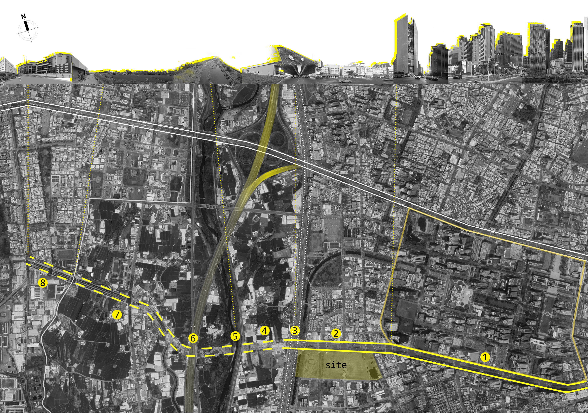

## 介紹
### 初步構想
可視化人流、交通大數據
不同社會階級的人在城市中的路線

畢業設計:轉運站 關注筏子溪東西兩側市民的互動情形 
    -台中七期 & 工業區+農業區

希望能輔助畢業設計的分析階段

### 資料蒐集困難
如何得知人流?如何得知人流數據中屬於哪些階級

---

## 案例參考

### A.城市交通大數據分析與可視化

[reference1](https://cloud.tencent.com/developer/article/2425302)

### B.Network Analysis

[reference2](https://www.agsrt.com/post/mastering-network-analysis-using-python-gisblogs-agsrt)

### C.模擬交通情形

模擬畢設中轉運站建築的客運車流、自行車、行人三者的關係

[reference3](https://blog.csdn.net/shebao3333/article/details/121188395)

