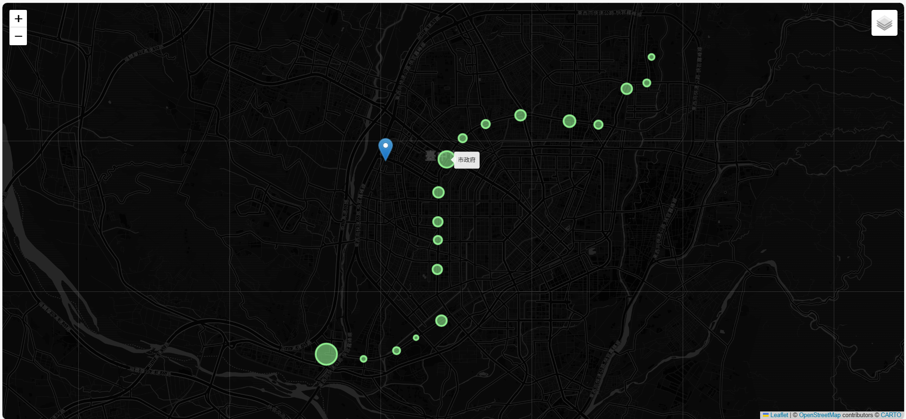
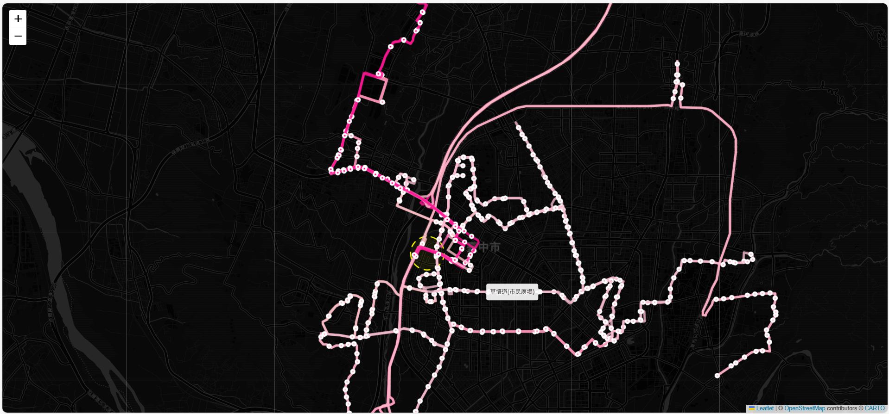
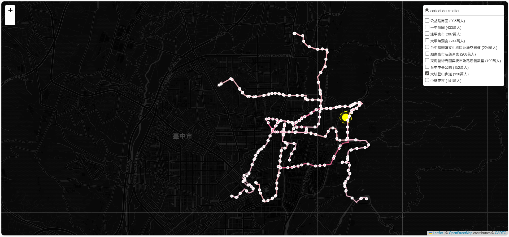
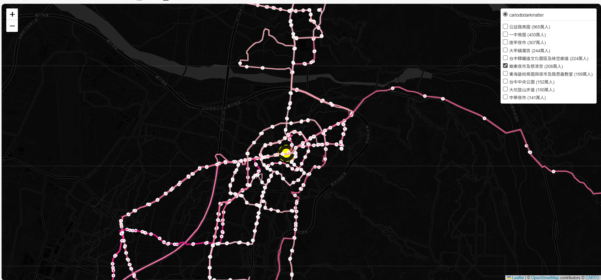

# Final Project
## 簡介
<<設計前期-基地交通分析的可視化工具>> 
由於預計要作轉運站設計，所以主要蒐集的資訊為基地周遭的大眾運輸、尤其是客運/公車等等的路線、人次資訊。

### 過程
蒐集資訊、過濾並整合成可用的資訊檔案、建立Folium map互動式地圖 
資訊主要來源:台中市政府資訊開放平臺、TDX運輸資料流通服務 
AI:Copilot(編寫程式)+Gemini(用於蒐集更多資訊)

### Github資料夾說明
在site-analysis有以下資料夾: 
1.code--存放製作出互動網頁的jupyter notebook以及python檔案 
2.html--存放基地分析的互動式網頁 
3.data--資訊(主要是json檔案)以及用以蒐集資訊的pyhon檔案，但因為檔案過大所以在github忽略上傳此資料夾 
4.image--用來存放readme的網頁展示圖，可忽略此資料夾 

## 成果分享
成果主要以互動式網頁的形式呈現，可以放大縮小地圖範圍 
並可以用鼠標點擊交通站點已顯示名稱資訊等

### 1.捷運綠線
定位捷運站點，並運用圓圈半徑呈現各站人次數量的比例關係 
 
互動式網頁連結-->[map_mrt.html](http://127.0.0.1:5500/site-analysis/html/map_mrt.html)

### 2.基地直徑1km內的客運站點路線
抓取設站於基地直徑1km內的客運路線，以分析基地使用者能以步行輕鬆搭乘哪些客運路線 
 
互動式網頁連結-->[1km_map.html](http://127.0.0.1:5500/site-analysis/html/1km_map.html)

### 3.台中十大景點周遭客運路線
將台中2025統計觀光人次前十名的景點定位，並運用圓圈半徑呈現各站人次數量的比例關係 
每一個景點皆有一個圖層，顯示其直徑1km內的客運路線，可藉由開關圖層比對各景點的客運交通情形

 
互動式網頁連結-->[1km_map.html](http://127.0.0.1:5500/site-analysis/html/tourist_spots_map.html)